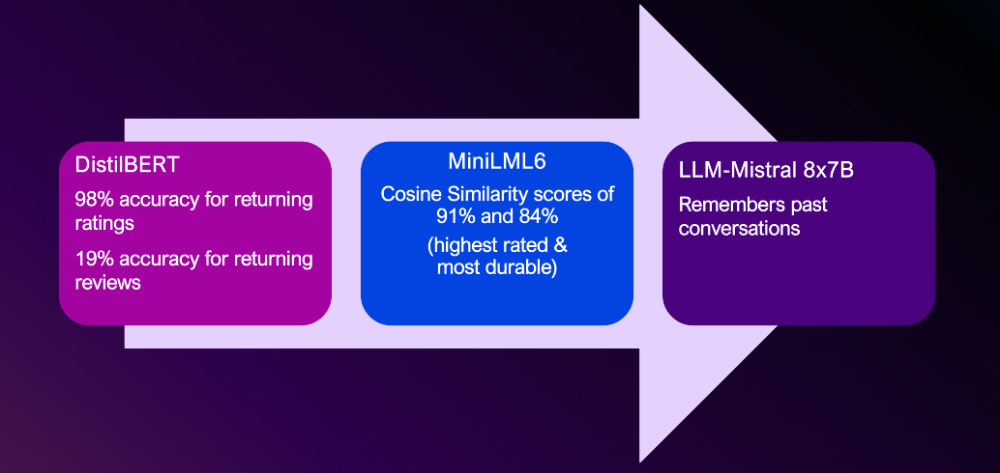
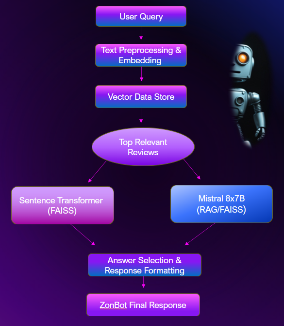
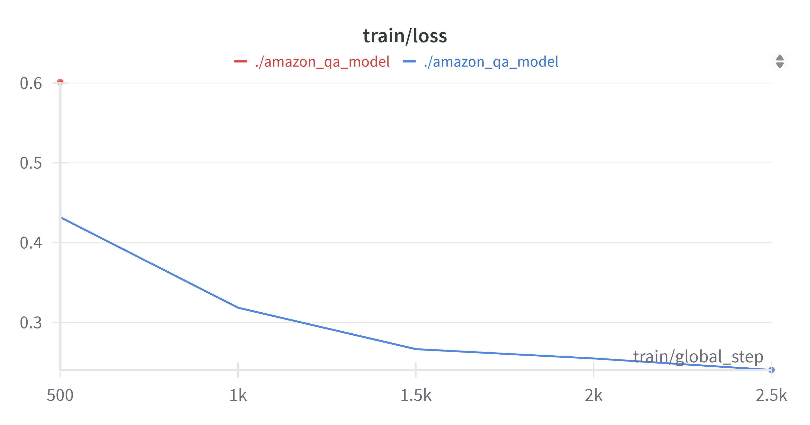
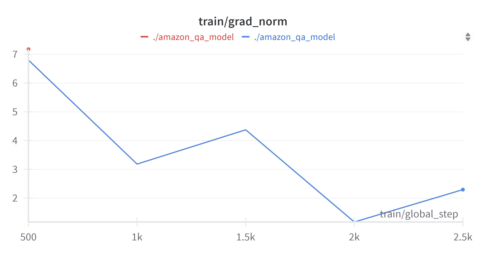
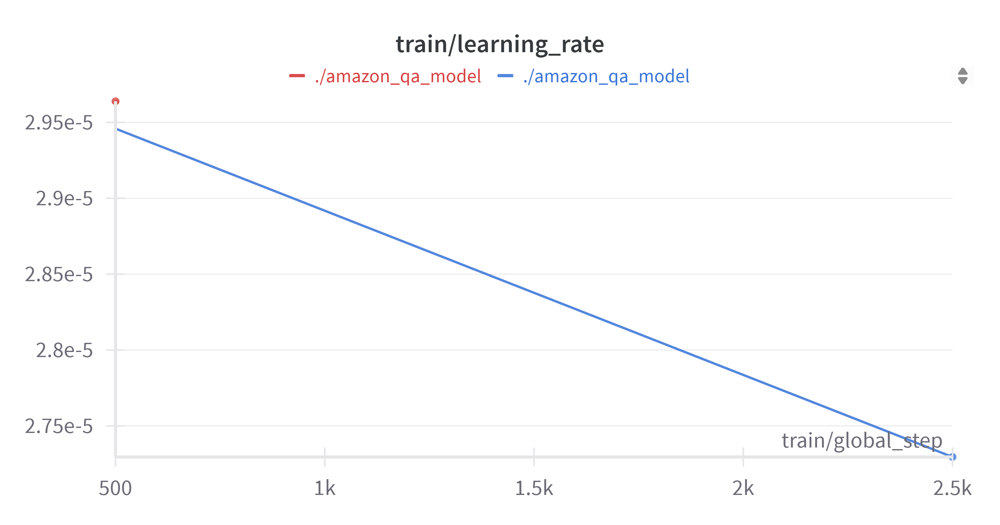

# Easier Buying with ZONBOT: 
## Saving time and making purchasing decisions simpler with Amazon's ChatBot

### Table of Contents

1. [Contributors](#contributors)
2. [Executive Summary](#executive-summary)
3. [Project Objectives](#project-objectives)
4. [Solution For Our-AI Powered Chatbot](#solution-for-our-ai-powered-chatbot)
5. [Design and Development](#design-and-development)
6. [Modeling Process](#modeling-process)
7. [Modeling Optimazation](#modeling-optimization)
8. [Running Instructions](#running-instructions)

### Contributors

Contributors to the project:
* **Deborah Aina (Advisor)**
* **Cameron Keplinger**
* **Eshumael Manhanzva**
* **Luther Johnson**
* **Saurabh Pratap Singh**
* **Sowmya Shetty**
* **Valarie Miller**

### Executive Summary 

This project features a chatbot assistant built with Streamlit, designed to serve as a recommendation engine for home and kitchen products on Amazon. It uses content-based filtering, leveraging Amazon reviews to suggest products tailored to user preferences. The assistant addresses the challenge of browsing countless products and reviews by streamlining the decision-making process—saving time and offering more relevant recommendations. The solution includes a Question-and-Answer model integrated with a large language model (LLM), enabling a conversational interface that enhances the shopping experience through intelligent, review-based suggestions.

* **Transformer Neural Network:** The foundational architecture used for natural language processing tasks.
* **Chatbot Assistant (Built with Streamlit):** A user-friendly interface that allows interactive conversations and product recommendations.
* **DistilBERT – Question and Answering Model:** A lightweight transformer model used to extract relevant information from a subset of Amazon review data.
* **Large Language Model (LLM) – Mistral with Prompt Engineering:** Processes raw Amazon review data using tailored prompts to generate accurate and context-aware responses.
* **Sentence-Transformer LML6 – Semantic Similarity Model:** Computes sentence embeddings to identify and match semantically similar Amazon reviews for enhanced recommendation accuracy.

### Project Objectives
#### How does your advanced machine learning approach solve this real-world problem?:
Our Machine Learning approach addresses the challenge of finding the right product by eliminating the need to sift through hundreds of listings and reviews, saving time, and delivering more relevant, personalized recommendations.
#### The Dataset Details:
* AmazonHomeKitchenReviews.CSV
* Data source is https://amazon-reviews-2023.github.io/#grouped-by-category
* 754,079 Total Records with 18 columns
* Categories: 
  * Kids Home Store
  * Valentines Day in Home
  * Bath
  * Bedding
  * Cosmetic Organizers
  * Dorm Room HQ
  * Event & Party Supplies
  * Furniture
  * Heating, Cooling & Air Quality
  * Home and Furniture Made in Italy
  * Home Decor Products
  * Irons & Steamers
  * Kitchen & Dining
  * Seasonal Decor
  * Storage & Organization
  * Vacuums & Floor Care
  * Wall Art
  * Small Appliance Parts

### Solution For Our AI-Powered Chatbot

1. The chatbot enhances your Amazon shopping experience with AI-powered assistance
2. Delivers top product recommendations with summarized reviews
3. Identifies products within your desired price range (lowest to highest)
4. Filters items based on your preferred features (e.g., color, size, brand)
5. Saves you valuable time and money by streamlining your shopping process

### Design and Development

#### Overview

* **Model Progression Pipeline**
  * DistilBERT
    * Achieves 98% accuracy for returning ratings
    * Lower performance (19%) for returning reviews
  * MiniLML6
    * Uses Cosine Similarity with scores of 91% and 84%
    * Identified as the highest rated and most durable in testing
  * LLM-Mistral 8x7B
    * Leverages large model capacity to remember past conversations
    * Powers complex and contextual interactions
   
* **Core ZonBot Features**
  * 🔄 Real-time Interactions for responsive user experience
  * 🧠 Dual Model Logic combining lightweight and heavyweight models
  * 🧬 Embeddings + FAISS for fast and accurate semantic search
  * 🧭 Dynamic Model Routing to optimize model selection per task
  * ⚡ Combined Speed & Depth via efficient model orchestration
  * 🌍 Use of Real-World Data for higher relevancy and robustness
  * 🧩 Modular & Expandable Design to support future enhancements
 
* **Key Technologies Used**
  * 🔧 PyTorch – for custom model development and tuning
  * 🌐 Streamlit – powering an interactive front-end UI
  * 📚 Retrieval-Augmented Generation (RAG) – enhances responses with live document retrieval
  * 🗃️ Vector Data Store – persistent, high-performance vector indexing for embeddings

#### Chatbot Workflow & User Interaction

* **User Query**
  * User submits a natural language question via the chatbot interface.
* **Text Preprocessing & Embedding**
  * The query is cleaned, tokenized, and transformed into a dense vector using an embedding model.
  * Ensures compatibility with the vector-based retrieval system.
* **Vector Data Store**
  * Embedded query is compared against a database of pre-embedded Amazon reviews using FAISS (Facebook AI Similarity Search).
  * Enables fast and efficient similarity search.
* **Top Relevant Reviews**
  * The system retrieves the most semantically relevant reviews related to the user query.
* **Dual Pathway Analysis**
  * Left Path: Sentence Transformer (FAISS) - Uses a Sentence-Transformer model to interpret and extract the best-matching answers from the retrieved reviews.
* **Right Path: Mistral 8x7B (RAG/FAISS)**
  * Applies a Retrieval-Augmented Generation (RAG) approach using Mistral 8x7B.
  * Integrates review context into generated responses for higher fluency and depth.
* **Answer Selection & Response Formatting**
  * Outputs from both models are evaluated and formatted into a coherent, context-aware response.
* **ZonBot Final Response**
  * The final answer is delivered to the user through the chatbot interface.

### Modeling Process

1. **Load the CSV data file** containing Amazon reviews.
2. **Load the API key** for accessing Hugging Face models.
3. **Convert all records in the DataFrame into documents** using the load_docs function.
4. **Define the path** for storing the vector database.
5. **Store the document vectors incrementally** using the *store_incrementally_in_fiass* function.
6. **Load the vector database and initialize the chat function** using the HuggingFaceEndpoint with the *mistralai/Mistral-7B-Instruct-v0.1* model as the LLM.
7. **Create a question-answer retrieval chain** using the *langchain.chains* framework.
8. **Use DistilBERT** *(DistilBertForQuestionAnswering)* as the first model for extracting answers from the documents.
9. **Use Mistral-7B-Instruct-v0.1** as the second model for generating natural, context-aware responses.
10. **Evaluate model performance** using the *F1 score* (balancing precision and recall) and the *BLEU score* (assessing language generation quality).

### Modeling Optimization
The downward trend in the training loss indicates that the model is improving its ability to fit the training data — it's making fewer mistakes.

The model is making smaller updates over time, which typically suggests it's converging — it's gradually adjusting weights with less intensity. This is a good sign, especially early in training, as it reflects the model settling into a local or global minimum in the loss landscape.

The learning rate is steadily decreasing from about *2.95e-5* to around *2.73e-5* over the training steps. This is a classic learning rate decay schedule — usually done to help the model stabilize and fine-tune during training. That dip in gradient norm near step 2000 coincides with a lower learning rate, which is expected — as gradients shrink, updates are smaller.

### Running Instructions

Getting Started with ZonBot (Amazon's Chatbot):

1. Ensure that **Streamlit** is installed on your machine. You can install it using *pip install streamlit* if needed.
2. **Download the entire repository** to your local machine for full functionality.
3. The Resource files are ENORMOUS and do not fit on GitHub.  **Download the Resources directory**, and all of its contents, from our Google Drive. https://drive.google.com/drive/folders/1lhJ_R6L_CBbmKEIo9yVNMFvvQNazSDSv
4. Make sure you **download Resource folder into the Project Repository** to insure that everything works properly. 
5. Launch the app by running the **app.py** file. This is the main user interface and connects with both *LLMmodel.py* and *miniLMsentencetransformer.py* in the background.
6. A **demonstration video** can be seen here: https://drive.google.com/drive/folders/1lhJ_R6L_CBbmKEIo9yVNMFvvQNazSDSv
7. Please use your **HuggingfaceEndpoint APIKEY** for access
8. Please refer to the **requirements.txt** file for the list of required libraries.

