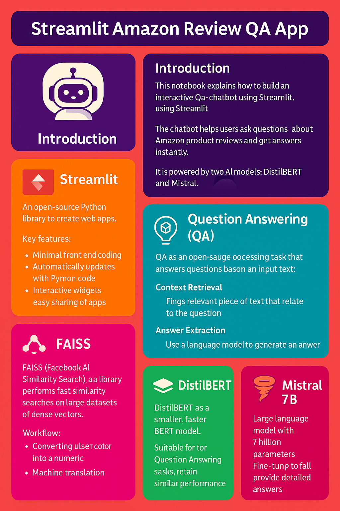
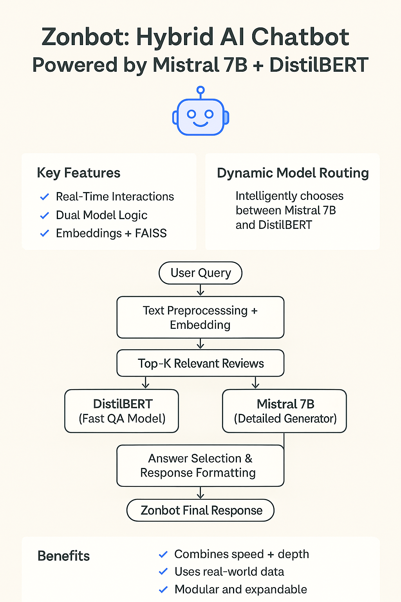
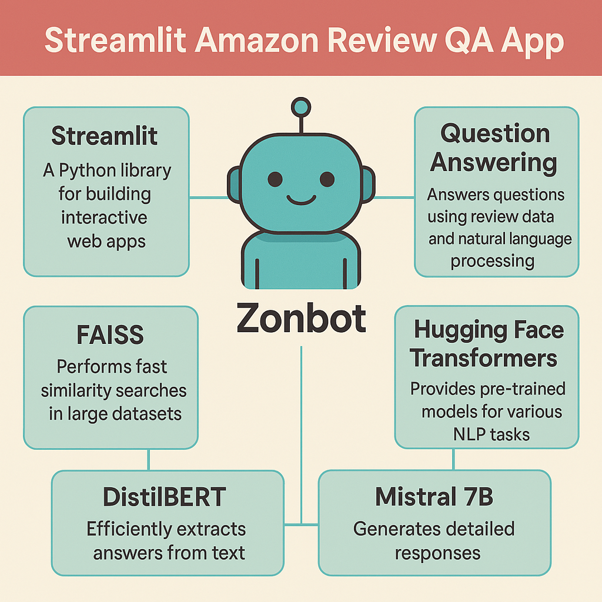

# Easier Buying with ZONBOT: 
## Saving time and making purchasing decisions simpler with Amazon's ChatBot

### Table of Contents

1. [Contributors](#contributors)
2. [Executive Summary](#executive-summary)
3. [Project Objectives](#project-objectives)
4. [Our Solution for ZonBot (an AI Powered Chatbot)](#our-solution-for-zonBot-(an-ai-powered-chatbot))
5. [Modeling Process](#modeling-process)
6. [Instruction](#instructions)

### Contributors

Contributors to the project:
* **Deborah Aina (Advisor)**
* **Cameron Keplinger**
* **Eshumael Manhanzva**
* **Luther Johnson**
* **Saurabh Pratap Singh**
* **Sowmya Shetty**
* **Valarie Miller**

### Executive Summary 

This project features a chatbot assistant built with Streamlit, designed to serve as a recommendation engine for home and kitchen products on Amazon. It uses content-based filtering, leveraging Amazon reviews to suggest products tailored to user preferences. The assistant addresses the challenge of browsing countless products and reviews by streamlining the decision-making process—saving time and offering more relevant recommendations. The solution includes a Question-and-Answer model integrated with a large language model (LLM), enabling a conversational interface that enhances the shopping experience through intelligent, review-based suggestions.

* **Transformer Neural Network:** The foundational architecture used for natural language processing tasks.
* **Chatbot Assistant (Built with Streamlit):** A user-friendly interface that allows interactive conversations and product recommendations.
* **DistilBERT – Question and Answering Model:** A lightweight transformer model used to extract relevant information from a subset of Amazon review data.
* **Large Language Model (LLM) – Mistral with Prompt Engineering:** Processes raw Amazon review data using tailored prompts to generate accurate and context-aware responses.

### Project Objectives
#### How does your advanced machine learning approach solve this real-world problem?:
Our Machine Learning approach addresses the challenge of finding the right product by eliminating the need to sift through hundreds of listings and reviews, saving time, and delivering more relevant, personalized recommendations.
#### The Dataset Details:
* AmazonHomeKitchenReviews.CSV
* Data source is https://amazon-reviews-2023.github.io/#grouped-by-category
* 754,079 Total Records with 18 columns
* Categories: 
  * Kids Home Store
  * Valentines Day in Home
  * Bath
  * Bedding
  * Cosmetic Organizers
  * Dorm Room HQ
  * Event & Party Supplies
  * Furniture
  * Heating, Cooling & Air Quality
  * Home and Furniture Made in Italy
  * Home Decor Products
  * Irons & Steamers
  * Kitchen & Dining
  * Seasonal Decor
  * Storage & Organization
  * Vacuums & Floor Care
  * Wall Art
  * Small Appliance Parts

### Our Solution for ZonBot (an AI Powered Chatbot)
1. The chatbot enhances your Amazon shopping experience with AI-powered assistance
2. Delivers top product recommendations with summarized reviews
3. Identifies products within your desired price range (lowest to highest)
4. Filters items based on your preferred features (e.g., color, size, brand)
5. Saves you valuable time and money by streamlining your shopping process

#### Data Modeling Strategy
This system combines advanced Natural Language Processing techniques (NLP) to deliver intelligent, conversational product recommendations:

* **Sentiment Analysis (BERT-based, Hugging Face):** Uses a fine-tuned BERT model to analyze the sentiment of Amazon product reviews, enhancing the quality of recommendations.
* **Question and Answering (DistilBERT via Hugging Face):** Implements DistilBERT to extract precise answers from review data, enabling the chatbot to respond to user queries effectively.
* **Text Summarization (via LLM):** Summarizes large volumes of review content to present concise, relevant insights to the user.
* **LangChain:** Used to manage the flow of conversation and integrate various LLM components seamlessly.
* **PyTorch Library:** Core machine learning framework used for training and deploying custom models.
* **RAG (Retrieval-Augmented Generation):** Enhances the chatbot's responses by integrating a custom knowledge base and vector data stores for more accurate, context-aware answers.
* **Translation (TBD):** Potential future feature to support multilingual users by translating queries and responses.
  

### Modeling Process

1. **Load the CSV data file** containing Amazon reviews.
2. **Load the API key** for accessing Hugging Face models.
3. **Convert all records in the DataFrame into documents** using the load_docs function.
4. **Define the path** for storing the vector database.
5. **Store the document vectors incrementally** using the *store_incrementally_in_fiass* function.
6. **Load the vector database and initialize the chat function** using the HuggingFaceEndpoint with the *mistralai/Mistral-7B-Instruct-v0.1* model as the LLM.
7. **Create a question-answer retrieval chain** using the *langchain.chains* framework.
8. **Use DistilBERT** *(DistilBertForQuestionAnswering)* as the first model for extracting answers from the documents.
9. **Use Mistral-7B-Instruct-v0.1** as the second model for generating natural, context-aware responses.
10. **Evaluate model performance** using the *F1 score* (balancing precision and recall) and the *BLEU score* (assessing language generation quality).

### Instructions

* Pandas & Pandas Plotting
* Python
* Scikit-learn
* Matplotlib
* Numpy

